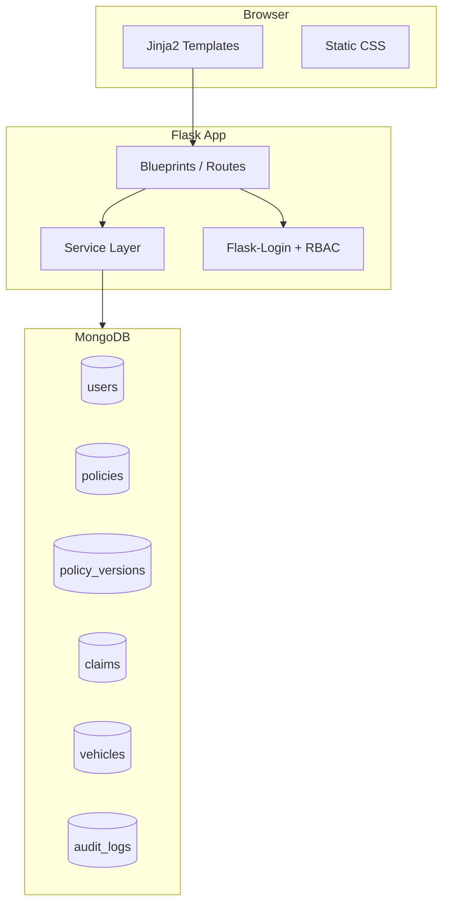
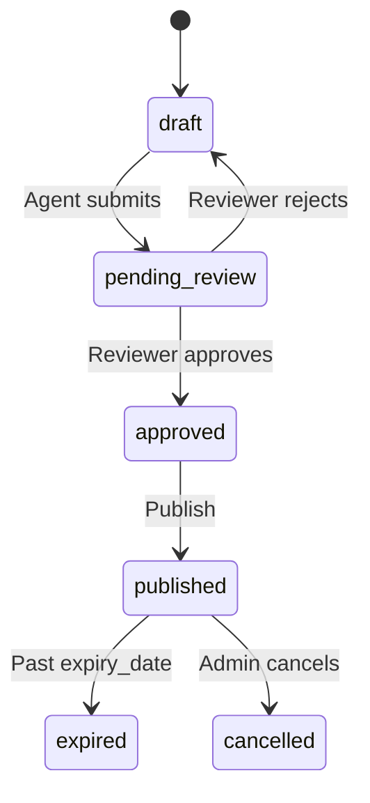
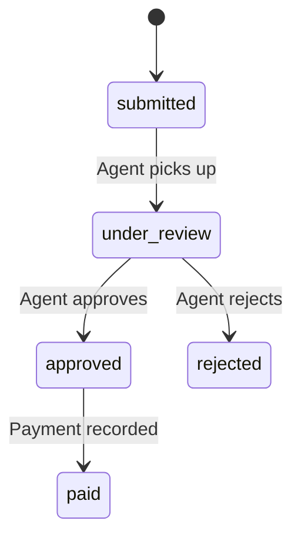

# POLICY GUARD — Flask + HTML/CSS + MongoDB Implementation Plan

## Project Purpose

**POLICY GUARD** is an automotive insurance management system for:
- Issuing and managing **vehicle insurance policies**
- Processing **insurance claims** tied to those policies
- Enforcing **approval workflows** (draft → review → published)
- Tracking **version history** and **audit logs** for compliance

Target users: **Admin**, **Agent/Reviewer**, and **Customer/Policyholder**.

---

## Architecture Overview



---

## Recommended Project Structure

```
POLICY GUARD/
├── IMPLEMENTATION_PLAN.md   # Full project plan (this document)
├── app/
│   ├── __init__.py          # create_app() factory
│   ├── config.py            # env-based config
│   ├── extensions.py        # MongoDB client, login manager
│   ├── models/              # document schemas / helpers
│   │   ├── user.py
│   │   ├── policy.py
│   │   ├── claim.py
│   │   └── vehicle.py
│   ├── services/            # business logic
│   │   ├── auth_service.py
│   │   ├── policy_service.py
│   │   ├── claim_service.py
│   │   ├── audit_service.py
│   │   └── search_service.py
│   ├── routes/              # Flask blueprints
│   │   ├── auth.py
│   │   ├── dashboard.py
│   │   ├── policies.py
│   │   ├── claims.py
│   │   └── admin.py
│   └── utils/
│       ├── decorators.py    # role_required()
│       └── validators.py
├── templates/
│   ├── base.html
│   ├── components/          # nav, flash messages, status badges
│   ├── auth/
│   ├── dashboard/
│   ├── policies/
│   └── claims/
├── static/
│   ├── css/
│   │   ├── main.css
│   │   └── components.css
│   └── js/
│       └── main.js            # minimal: form validation, filters
├── scripts/
│   └── seed_db.py             # demo users, policies, claims
├── requirements.txt
├── .env.example
├── .gitignore
├── run.py
└── README.md
```

---

## Tech Stack & Dependencies

| Layer | Choice |
|-------|--------|
| Backend | Flask 3.x, Flask-Login, Flask-WTF (CSRF) |
| Database | MongoDB via `pymongo` (or `flask-pymongo`) |
| Templates | Jinja2 (server-rendered HTML) |
| Styling | Custom CSS (no framework required; optional: simple utility classes) |
| Security | `werkzeug` password hashing, session cookies, role checks |
| Config | `python-dotenv` for `MONGO_URI`, `SECRET_KEY` |

**`requirements.txt`** (initial):
```
flask>=3.0
flask-login>=0.6
flask-wtf>=1.2
pymongo>=4.6
python-dotenv>=1.0
werkzeug>=3.0
```

---

## MongoDB Data Model

### Collections

**`users`**
```python
{
  "_id": ObjectId,
  "email": "agent@example.com",
  "password_hash": "...",
  "role": "admin" | "agent" | "customer",
  "full_name": "Jane Doe",
  "phone": "+254...",
  "created_at": ISODate
}
```

**`vehicles`**
```python
{
  "_id": ObjectId,
  "owner_id": ObjectId,       # ref users
  "make": "Toyota",
  "model": "Corolla",
  "year": 2022,
  "registration_number": "KAA 123A",
  "vin": "...",
  "created_at": ISODate
}
```

**`policies`**
```python
{
  "_id": ObjectId,
  "policy_number": "PG-2026-00001",   # unique index
  "customer_id": ObjectId,
  "vehicle_id": ObjectId,
  "policy_type": "comprehensive" | "third_party" | "fire_theft",
  "status": "draft" | "pending_review" | "approved" | "published" | "expired" | "cancelled",
  "premium_amount": 45000.00,
  "coverage_details": { "liability": ..., "deductible": ... },
  "effective_date": ISODate,
  "expiry_date": ISODate,
  "current_version": 3,
  "created_by": ObjectId,
  "assigned_reviewer": ObjectId | null,
  "created_at": ISODate,
  "updated_at": ISODate
}
```

**`policy_versions`** (separate collection for version history)
```python
{
  "_id": ObjectId,
  "policy_id": ObjectId,
  "version_number": 3,
  "snapshot": { ...full policy fields at this version... },
  "change_summary": "Updated premium and coverage",
  "changed_by": ObjectId,
  "created_at": ISODate
}
```

**`claims`**
```python
{
  "_id": ObjectId,
  "claim_number": "CLM-2026-00001",   # unique index
  "policy_id": ObjectId,
  "customer_id": ObjectId,
  "status": "submitted" | "under_review" | "approved" | "rejected" | "paid",
  "incident_date": ISODate,
  "incident_location": "...",
  "description": "...",
  "amount_claimed": 120000.00,
  "amount_approved": null,
  "assigned_agent": ObjectId | null,
  "review_notes": "...",
  "created_at": ISODate,
  "updated_at": ISODate
}
```

**`audit_logs`**
```python
{
  "_id": ObjectId,
  "entity_type": "policy" | "claim" | "user",
  "entity_id": ObjectId,
  "action": "create" | "update" | "status_change" | "approve" | "reject",
  "performed_by": ObjectId,
  "details": { "from_status": "draft", "to_status": "pending_review" },
  "timestamp": ISODate
}
```

### Indexes to create on startup
- `users.email` (unique)
- `policies.policy_number` (unique)
- `claims.claim_number` (unique)
- `policies.status`, `policies.customer_id`
- `claims.policy_id`, `claims.status`
- `audit_logs.entity_type + entity_id`
- `policy_versions.policy_id + version_number`

---

## Role-Based Access Control

| Action | Admin | Agent | Customer |
|--------|-------|-------|----------|
| View all policies/claims | Yes | Yes | Own only |
| Create policy | Yes | Yes | No |
| Edit draft policy | Yes | Yes | No |
| Submit for review | Yes | Yes | No |
| Approve/reject policy | Yes | Yes | No |
| Publish policy | Yes | Yes | No |
| File claim | Yes | Yes | Yes (own policy) |
| Review/adjudicate claim | Yes | Yes | No |
| View audit logs | Yes | Yes | No |
| Manage users | Yes | No | No |

Implement via `@role_required("admin", "agent")` decorator in `app/utils/decorators.py`.

---

## Core Workflows

### Policy lifecycle


### Claim lifecycle


Every status transition writes to **`audit_logs`** and (for policies) optionally creates a new **`policy_versions`** snapshot.

---

## Flask Routes (Pages)

### Auth — `app/routes/auth.py`
- `GET/POST /login`
- `GET/POST /register` (customer self-registration)
- `GET /logout`

### Dashboard — `app/routes/dashboard.py`
- `GET /` — role-specific dashboard (counts: active policies, pending claims, drafts awaiting review)

### Policies — `app/routes/policies.py`
- `GET /policies` — list with search/filter (status, type, registration, policy number)
- `GET /policies/new` — create form (admin/agent)
- `POST /policies` — save draft
- `GET /policies/<id>` — detail view + version history
- `GET/POST /policies/<id>/edit` — edit draft
- `POST /policies/<id>/submit` — submit for review
- `POST /policies/<id>/approve` — approve
- `POST /policies/<id>/reject` — send back to draft
- `POST /policies/<id>/publish` — publish
- `GET /policies/<id>/versions/<v>` — view historical version

### Claims — `app/routes/claims.py`
- `GET /claims` — list with filters
- `GET /claims/new?policy_id=` — file claim (customer/agent)
- `POST /claims` — submit claim
- `GET /claims/<id>` — detail + timeline
- `POST /claims/<id>/review` — agent updates status, notes, approved amount

### Admin — `app/routes/admin.py`
- `GET /admin/users` — user list
- `GET /admin/audit` — searchable audit log
- `POST /admin/users/<id>/role` — change role (admin only)

---

## Frontend (HTML/CSS) Plan

### Layout — `templates/base.html`
- Top nav: Dashboard, Policies, Claims, Admin (role-gated)
- Flash message area for success/error feedback
- Responsive sidebar or top-bar layout

### Key pages
| Template | Purpose |
|----------|---------|
| `auth/login.html` | Login form |
| `dashboard/index.html` | Stats cards + recent activity |
| `policies/list.html` | Table + search/filter bar |
| `policies/form.html` | Create/edit policy (vehicle + coverage fields) |
| `policies/detail.html` | Policy info, status actions, version list |
| `claims/list.html` | Claims table with status badges |
| `claims/form.html` | File claim form |
| `claims/detail.html` | Claim review panel for agents |
| `admin/audit.html` | Audit log table |

### CSS approach — `static/css/main.css`
- CSS variables for colors (primary, success, warning, danger)
- Reusable components: `.card`, `.badge`, `.btn`, `.table`, `.form-group`
- Status badge colors mapped to policy/claim statuses
- Mobile-friendly tables (horizontal scroll on small screens)

No JavaScript framework needed; optional minimal JS for client-side form validation and dynamic filter toggles.

---

## Service Layer Responsibilities

Keep routes thin; put logic in services:

- **`policy_service.py`**: CRUD, status transitions, version snapshots, policy number generation (`PG-YYYY-NNNNN`)
- **`claim_service.py`**: CRUD, claim number generation, link validation (policy must be published/active)
- **`audit_service.py`**: Central `log_action(entity_type, entity_id, action, user, details)` called from all write operations
- **`search_service.py`**: MongoDB `$regex` / compound filters for list pages
- **`auth_service.py`**: Register, authenticate, password hashing

---

## Configuration & Environment

**`.env.example`**
```
FLASK_ENV=development
SECRET_KEY=change-me-in-production
MONGO_URI=mongodb://localhost:27017
MONGO_DB_NAME=policy_guard
```

**`app/config.py`** — load from env; separate `DevelopmentConfig` / `ProductionConfig`.

**`run.py`** — entry point: `python run.py` starts dev server on `http://127.0.0.1:5000`.

---

## Implementation Phases

### Phase 0 — Plan Document
- Save this file as `IMPLEMENTATION_PLAN.md` in the project root (done)

### Phase 1 — Foundation
- Initialize project structure, `requirements.txt`, `.gitignore`, `.env.example`
- Implement `create_app()` with MongoDB connection in `app/extensions.py`
- Create index setup function (run on app startup)
- Base template + main CSS

### Phase 2 — Authentication
- User model + registration/login/logout
- Flask-Login session management
- Role decorator + nav visibility by role
- Seed script with demo accounts (admin, agent, customer)

### Phase 3 — Vehicles & Policies
- Vehicle CRUD (nested in policy form or separate step)
- Policy CRUD with draft status
- Policy list with search/filter
- Policy detail page

### Phase 4 — Approval Workflow & Versioning
- Status transition endpoints with validation (only valid transitions allowed)
- `policy_versions` snapshot on every edit after first publish
- Version history UI on policy detail page
- Audit logging for all policy actions

### Phase 5 — Claims Processing
- File claim against active/published policy
- Claim list + detail + agent review actions
- Audit logging for claim status changes
- Dashboard widgets for pending claims

### Phase 6 — Admin & Audit UI
- Admin user management page
- Global audit log viewer with filters (entity type, date range, user)
- Polish flash messages, error pages (404/403)

### Phase 7 — Seed Data & Documentation
- `scripts/seed_db.py` — sample vehicles, policies at various statuses, claims
- `README.md` — MongoDB install, env setup, run instructions, demo credentials

---

## Local Development Setup (document in README)

1. Install MongoDB locally (or use MongoDB Atlas free tier)
2. Create virtualenv: `python -m venv venv`
3. `pip install -r requirements.txt`
4. Copy `.env.example` → `.env` and set values
5. `python scripts/seed_db.py`
6. `python run.py`
7. Open `http://127.0.0.1:5000`

---

## Security Checklist

- Hash passwords with `werkzeug.security.generate_password_hash`
- Enable CSRF on all POST forms via Flask-WTF
- Validate ObjectIds before DB queries
- Scope customer queries to `customer_id == current_user.id`
- Never store plain-text passwords or secrets in repo
- Use `SECRET_KEY` from environment

---

## Out of Scope (Future Enhancements)

These are intentionally excluded from the initial build but easy to add later:
- File uploads for claim photos/documents (GridFS)
- Email notifications on status changes
- REST API / mobile app
- Payment gateway integration
- Docker Compose deployment

---

## Success Criteria

The project is complete when:
1. All three roles can log in and see appropriate dashboards
2. Agents can create policies, run them through draft → review → publish
3. Policy edits create version history entries
4. Customers can file claims on their active policies
5. Agents can approve/reject claims with audit trail
6. Admin can view users and full audit log
7. Search/filter works on policies and claims list pages
8. README documents setup and demo login credentials
